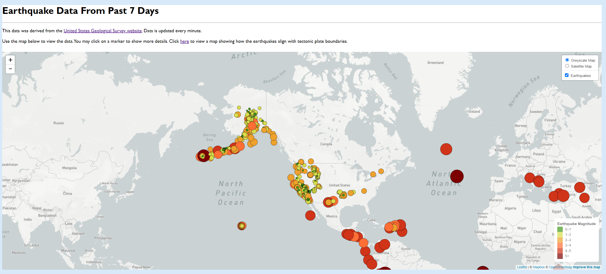
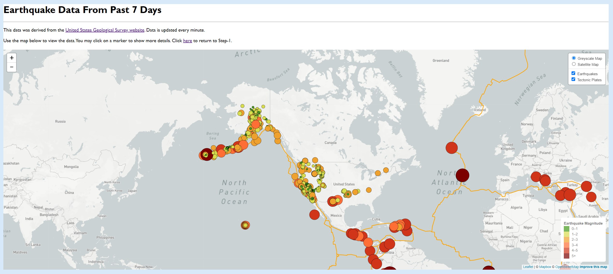
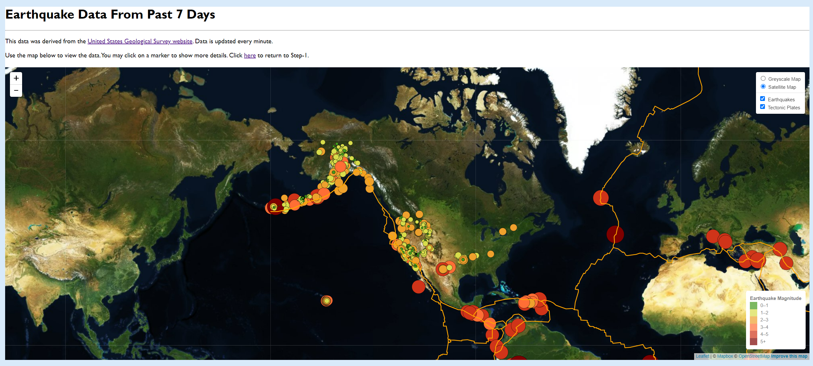

# Leaflet Homework - Visualising Data with Leaflet

## Background

Welcome to the United States Geological Survey, or USGS for short! The USGS is responsible for providing scientific data about natural hazards, the health of our ecosystems and environment; and the impacts of climate and land-use change. Their scientists develop new methods and tools to supply timely, relevant, and useful information about the Earth and its processes. As a new hire, I will be helping them out with an exciting new project!

The USGS is interested in building a new set of tools that will allow them visualise their earthquake data. They collect a massive amount of data from all over the world each day, but they lack a meaningful way of displaying it. Their hope is that being able to visualise their data will allow them to better educate the public and other government organisations (and hopefully secure more funding..) on issues facing our planet.

## My Task

### Level 1: Basic Visualisation

My first task was to visualise an earthquake data set. I achieved this by visiting the [USGS GeoJSON Feed](http://earthquake.usgs.gov/earthquakes/feed/v1.0/geojson.php) page and picking a data set to visualise. In this case, I chose earthquake data from the last 7 days, which is updated every minute.

I then created a map using the Javascript plugin, [Leaflet](https://leafletjs.com/) using the [Mapbox Static Tiles API](https://docs.mapbox.com/api/maps/static-tiles/). I plotted all the earthquakes from my dataset based on their latitude and longitude. Each marker on the map should reflect the earthquake's magnitude. You should be able to click on a marker and read more information about the earthquake. Below is a screenshot of the map:

You may access the github page [here](https://sarahcasauria.github.io/leaflet-challenge/Step-1/index.html). NOTE: You will need a mapbox API key to load the data.
- - -

### Level 2: More Data (Optional)

For this optional task, I plotted a second data set on the map to illustrate the relationship between tectonic plates and seismic activity. Data on tectonic plates can be found at <https://github.com/fraxen/tectonicplates>. Below are two screenshots of the map:

You may access the github page [here](https://sarahcasauria.github.io/leaflet-challenge/Step-2/index.html). NOTE: You will need a mapbox API key to load the data.
- - -

### Assessment

The final product was be assessed on the following metrics:

* Completion of assigned tasks

* Visual appearance

* Professionalism

**Good luck!**

### Copyright

© 2021 Trilogy Education Services, LLC, a 2U, Inc. brand. Confidential and Proprietary. All Rights Reserved.
